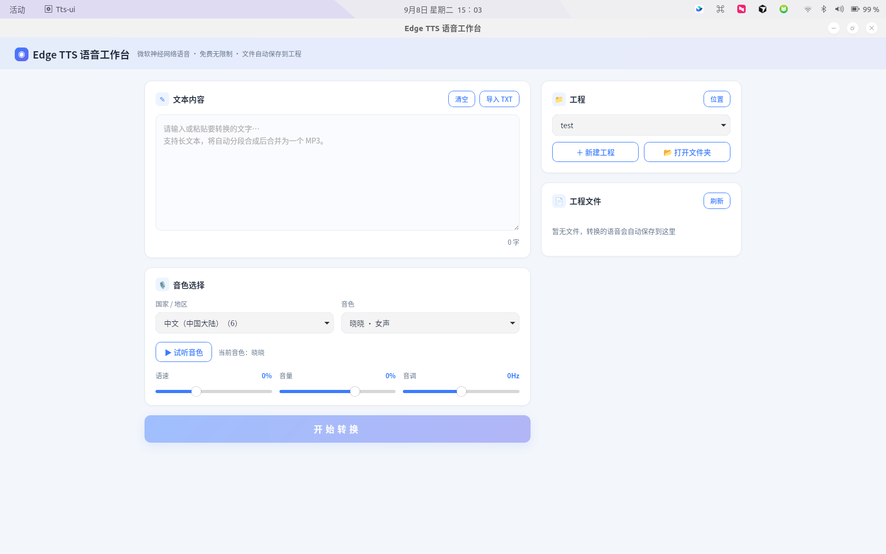

# Edge TTS 语音工作台

中文 | [English](README_EN.md)

基于微软 Edge 神经网络语音（edge-tts）的**跨平台桌面应用**，支持 Windows（exe）、macOS（dmg）、Linux（deb / AppImage）。

无需 API 密钥，完全免费，本地运行，界面干净整洁、简单易上手。

## 功能

- **音色选择**：按国家/地区分组选择音色（142 个国家/地区，中文置顶），音色人物显示母语名称（如中国的「晓晓」、日本的「七海」、韩国的「선히」）
- **试听**：每个音色可一键试听，结果本地缓存，二次试听秒开
- **文字转语音**：输入文本即可合成，支持语速 / 音量 / 音调调节；长文本自动按句子边界分段合成后合并为单个 MP3
- **工程管理**：创建工程文件夹，合成结果自动保存到工程中；支持外置工程（自选存储位置），多工程自由切换
- **首次启动引导**：第一次打开时引导选择默认工程存储位置
- **依赖自检**：启动时自动检测缺失依赖并尝试安装（Linux 缺 WebKit2GTK 时通过系统包管理器安装，Windows 缺 WebView2 Runtime 时自动下载微软官方引导程序安装；实在无法安装则回退浏览器模式）

## 效果展示



## 下载使用

前往 [Releases](https://github.com/GavinLiuOnline/edge-tts-gui/releases) 下载对应平台产物：

| 平台 | 产物 | 说明 |
|------|------|------|
| Windows | `tts-ui.exe` | 单文件绿色版，双击运行（需 WebView2，Win10/11 一般自带，缺失会自动安装） |
| Linux | `tts-ui_x.y.z_amd64.deb` | `sudo apt install ./tts-ui_*.deb` 安装，自动补齐 WebKit2GTK 依赖 |
| Linux | `tts-ui-x.y.z-x86_64.AppImage` | 免安装，`chmod +x` 后直接运行（需系统有 WebKit2GTK，缺失时启动器会引导安装） |
| macOS | `tts-ui-x.y.z-macos.dmg` | 挂载后将 .app 拖入「应用程序」 |

首次运行会在系统原生弹窗中选择工程存储位置，之后即可直接使用。

## 从源码运行

要求 Python 3.10+。

```bash
pip install -r requirements.txt   # edge-tts / fastapi / uvicorn / pywebview
python app.py                     # 启动桌面窗口
python app.py --web               # 仅启动本地服务, 用浏览器访问 (调试用)
```

源码运行时若缺少 Python 包会自动通过 pip 安装。

> Linux 桌面窗口依赖 WebKit2GTK：
> - Ubuntu/Debian: `sudo apt install python3-gi python3-gi-cairo gir1.2-webkit2-4.1 libwebkit2gtk-4.1-0`
> - Fedora: `sudo dnf install python3-gobject webkit2gtk4.1`
> - Arch: `sudo pacman -S webkit2gtk`

## 如何编译

各平台需在本机打包（不支持交叉编译）。

### Linux（deb + AppImage）

```bash
./build_linux.sh
```

前置要求：`python3-gi`、`gir1.2-webkit2-4.1`、`libwebkit2gtk-4.1-0`、`pyinstaller`、`dpkg-deb`。
产物在 `dist/`：单文件二进制 `tts-ui`、`tts-ui_x.y.z_amd64.deb`、`tts-ui-x.y.z-x86_64.AppImage`。
构建结束会自动运行产物自检（校验 GUI 后端是否打入，缺失即失败）。

### Windows（exe）

在装有 Python 3.10+ 的 Windows 机器上：

```bat
build_windows.bat
```

产物：`dist\tts-ui.exe`（单文件、无控制台窗口）。

### macOS（dmg）

```bash
./build_macos.sh
```

产物：`dist/tts-ui-x.y.z-macos.dmg`。

### 云端编译（GitHub Actions）

仓库已配置 [`.github/workflows/build.yml`](.github/workflows/build.yml)：

- 推送 `v*` 标签（如 `git tag v1.1.1 && git push origin v1.1.1`）自动触发三平台矩阵构建，并发布到 Release
- 也可在 Actions 页面手动触发（workflow_dispatch）

## 配置与环境变量

配置保存在 `~/.tts_ui_config.json`（工程存储位置、工程注册表等），可通过环境变量覆盖默认路径：

| 环境变量 | 默认值 | 说明 |
|----------|--------|------|
| `TTS_UI_HOME` | `~/tts-projects` | 工程默认根目录（可在应用内更改） |
| `TTS_UI_CACHE` | `~/.tts_ui_cache/previews` | 试听缓存目录 |
| `TTS_UI_CONFIG` | `~/.tts_ui_config.json` | 配置文件路径 |

## 项目结构

```
tts-ui/
├── app.py                     # 后端: FastAPI 本地服务 + pywebview 桌面窗口 + 依赖自检
├── static/                    # 前端: 纯静态 HTML/CSS/JS
│   ├── index.html
│   ├── app.js
│   └── style.css
├── tts-ui.spec                # PyInstaller 打包配置 (过滤 GTK 图标/主题资源, 控制体积)
├── build_linux.sh             # Linux 打包: PyInstaller + deb + AppImage + 自检
├── build_windows.bat          # Windows 打包: PyInstaller onefile
├── build_macos.sh             # macOS 打包: PyInstaller + dmg
├── tools/make_icon.py         # 生成应用图标 (png / ico / icns)
├── requirements.txt
└── .github/workflows/build.yml  # 云端三平台构建 + 自动发布
```

## 技术栈

- **后端**：Python · FastAPI + uvicorn（本地 HTTP 服务）· edge-tts（微软 Edge 神经网络语音）
- **前端**：原生 HTML / CSS / JavaScript，无构建工具
- **桌面窗口**：pywebview（复用操作系统 WebView：Linux WebKit2GTK / Windows WebView2 / macOS WKWebView）
- **打包**：PyInstaller（单文件）· dpkg-deb · AppImage · hdiutil
